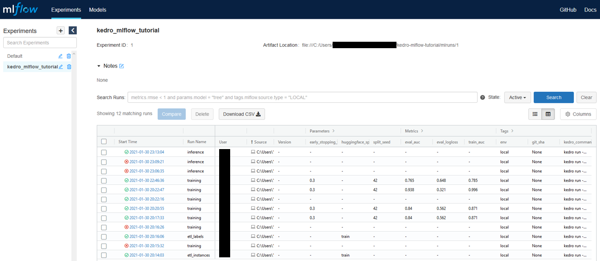
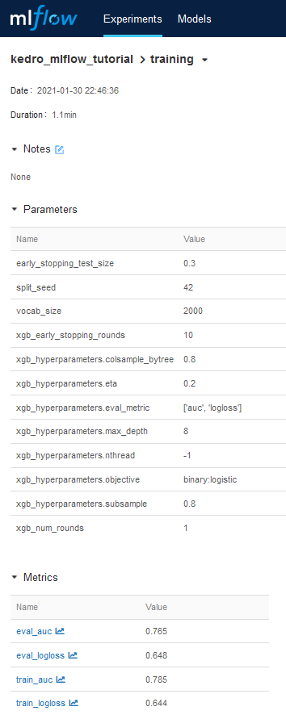
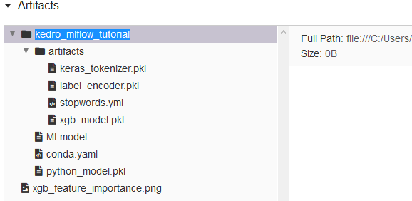

# kedro mlflow tutorial

## Introduction

### Pre-requisite

This tutorial assumes the user is familiar with Kedro. We will refer to a `kedro>=0.18.0, <0.19.0` project template files.

If you want to check out for older kedro version, see:
- the branch [``main-kedro-0.16``](https://github.com/Galileo-Galilei/kedro-mlflow-tutorial/tree/main-kedro-0.16) for  `kedro>=0.16.0, <0.17.0`
- the branch [``main-kedro-0.17``](https://github.com/Galileo-Galilei/kedro-mlflow-tutorial/tree/main-kedro-0.17) for  `kedro>=0.17.0, <0.18.0`

### Goal of the tutorial

This tutorial shows how to use [kedro-mlflow plugin](https://github.com/Galileo-Galilei/kedro-mlflow) as a mlops framework.

Specifically, it will focus on how one can use the `pipeline_ml_factory` to maintain consistency between training and inference and prepare deployment. It will show best practices on code organization to ensure easy transition to deployment and strong reproducibility.

We will not emphasize the fact that [``kedro-mlflow`` provides advanced versioning capabilities tracking](https://kedro-mlflow.readthedocs.io/en/stable/source/04_experimentation_tracking/index.html), including automatic parameters tracking, but look at the documentation to see what it is capable of!

### Disclaimer

**This is NOT a Kaggle competition. I will not try to create the best model (nor even a _good_ model)** to solve this problem. This should not be considered as data science best practices on how to train a model. Each pipeline node has a specific educational purpose to explain one use case ``kedro-mlflow`` can handle.

### Installation

1. Clone the repo:

```bash
git clone https://github.com/Galileo-Galilei/kedro-mlflow-tutorial
cd kedro-mlflow-tutorial
```

2. Install dependencies:

```bash
conda create -n kedro_mlflow_tutorial python=3.9
conda activate kedro_mlflow_tutorial
pip install -e src
```

*Note: You don't need to call ``kedro mlflow init`` command as you do in a freshly created repo since the ``mlflow.yml`` is already pre-configured.*

## Project components

### Introducing the task and dataset

We will use the [IMDB movie review](https://www.kaggle.com/lakshmi25npathi/imdb-dataset-of-50k-movie-reviews) dataset as an example. This dataset contains 50k movie reviews with associated "positive" or "negative" value manually labelled by a human.

We will train a classifier for binary classification to predict the sentiment associated to a movie review.

You can find [many notebooks on Kaggle](https://www.kaggle.com/lakshmi25npathi/imdb-dataset-of-50k-movie-reviews/notebooks) to learn more about this dataset.

### Folder architecture

The project is divided into 3 applications (i.e. subfolders in the [src/kedro_mlflow_tutorial/pipelines](https://github.com/Galileo-Galilei/kedro-mlflow-tutorial/tree/main/src/kedro_mlflow_tutorial/pipelines)). The reasons for such a division is detailed in [kedro-mlflow's documentation]():

- etl: This app contains 2 pipelines:
  - `etl_instances`: this pipeline creates the "instances" dataset, which is the input of the ml app. The ``instances`` dataset represent the raw data any user of your ml pipeline should send you. In practice this is a business object (here, raw text), not something that requires heavy preprocessing from your user.
  - `etl_labels`: this pipeline creates the "labels" dataset, which is another input of the ml app since our task is supervised. It must be a different pipeline from the one which creates the instances because when you will deploy your model, the labels will not be available!
- ml: This app contains 2 pipelines:
  - ``training``: this pipeline trains and persists your machine learning model as well as any necessary artifacts (here, a tokenizer) which will be reused by inference.
  - ``inference``: this pipeline is the one you will deploy to your end user. It takes ``instances`` and returns ``predictions``
  - it is possible to add many other pipelines, e.g. `monitoring` (takes ``instances`` and return stats on predictions), `evaluation` (takes ``instances`` and ``labels`` and returns updated model metrics), `explanation` (takes instances and returns model explanations like shap values, activation maps...). We do not add such pipelines to keep the example simple
- user_app: This application is composed of as many pipelines as you have use cases you want to use your model for. In this example, we will stick to a single pipeline:
  - ``user_app``: this pipeline takes a mlflow model (the entire inference pipeline), or directly the predictions and performs all the business logic.

> For the sake of simplicity and educational purpose, we will keep the etl and user_app pipelines very simple and focus on the ml pipelines. In real life, etl and user_app may be very complex.

### Create the instances and labels datasets

To create the ``instances`` and ``labels`` datasets, run the [etl pipelines](https://github.com/Galileo-Galilei/kedro-mlflow-tutorial/blob/main/src/kedro_mlflow_tutorial/pipelines/etl_app/pipeline.py#L9):

```bash
kedro run --pipeline=etl_instances
kedro run --pipeline=etl_labels
```

Since they are [persisted in the ``catalog.yml`` file](https://github.com/Galileo-Galilei/kedro-mlflow-tutorial/blob/main/conf/base/catalog.yml#L7), you will be able to reuse them afterwards.

*Note: You can [change the *huggingface_split* parameters in `globals.yml`](https://github.com/Galileo-Galilei/kedro-mlflow-tutorial/blob/main/conf/base/globals.yml#L1) and rerun the pipelines to create test data.*

### Pipeline packaging and autologging

#### Bind your training and inference pipelines declaratively

The key part is to convert your ``training`` pipeline from a [``Pipeline`` kedro object](https://kedro.readthedocs.io/en/0.17.7/kedro.pipeline.Pipeline.html) to a [``PipelineML`` kedro-mlflow object]((https://kedro-mlflow.readthedocs.io/en/stable/source/07_python_objects/03_Pipelines.html)).

This can be [done in the ``pipeline_registry.py`` file](https://github.com/Galileo-Galilei/kedro-mlflow-tutorial/blob/9bca6055183453f49beade415517b17e17b5affc/src/kedro_mlflow_tutorial/pipeline_registry.py#L26-L39) thanks to the ``pipeline_ml_factory`` helper function.

The [``register_pipeline`` hook of the``pipeline_registry.py``](https://github.com/Galileo-Galilei/kedro-mlflow-tutorial/blob/9bca6055183453f49beade415517b17e17b5affc/src/kedro_mlflow_tutorial/pipeline_registry.py#L13-L53) looks like this (below snippet is slightly simplified for readability):

```python
from kedro_mlflow_tutorial.pipelines.ml_app.pipeline import create_ml_pipeline

...

def register_pipelines() -> Dict[str, Pipeline]:

    ...

    ml_pipeline = create_ml_pipeline()
    inference_pipeline = ml_pipeline.only_nodes_with_tags("inference")
    training_pipeline_ml = pipeline_ml_factory(
        training=ml_pipeline.only_nodes_with_tags("training"),
        inference=inference_pipeline,
        input_name="instances",
        log_model_kwargs=dict(
            artifact_path="kedro_mlflow_tutorial",
            conda_env={
                "python": 3.9.12,
                "build_dependencies": ["pip"],
                "dependencies": [f"kedro_mlflow_tutorial=={PROJECT_VERSION}"],
            },
            signature="auto",
        ),
    )
    ...

    return {
        "training": training_pipeline_ml,
    }
```

Let's break it down:

- we already have a ``training`` and ``inference`` pipelines written in pure kedro, that are filtered out a bigger pipeline from their tags
- We "bind" these two pipelines with the ``pipeline_ml_factory`` function with the following arguments:
  - ``training``: the pipeline that will be executed when launching the "kedro run --pipeline=training" command.
  - ``inference``: the pipeline which be logged in mlflow as a [Mlflow Model](https://www.mlflow.org/docs/latest/models.html) at the end of the training pipeline.
  - ``conda_env`` (optional): the conda environment with the package you need for inference. You can pass a python dictionnary, or a path to your ``requirements.txt`` or ``conda.yml`` files.
  - ``log_model_kwargs``: Any argument you want to pass to [``mlflow.pyfunc.log_model()``](https://www.mlflow.org/docs/1.26.1/python_api/mlflow.pyfunc.html#mlflow.pyfunc.log_model), e.g.:
    - ``input_name``: the name in the ``catalog.yml`` of the dataset which contains the data (either to train on for the training pipeline or to predict on for the inference pipeline). This must be the same name for both pipelines.
    - ``artifact_path`` (optional): the name of the folder containing the model in mlflow.
    - ``signature`` (optional): The [mlflow signature](https://mlflow.org/docs/latest/models.html#model-signature) of your ``input_name`` dataset (``instances`` in our example). This is an object that contains the columns names and types. This will be use to make a consistency check when predicting with the model on new data. If you set it to "auto", ``kedro-mlflow`` will automatically retrieve it from the training data. This is experimental and sometimes comes with bugs, you can set it to "None" to avoid using it.

#### Create your ml application

The ml application (which contains both the ``training`` and ``inference`` pipelines) can be created step by step. The goal is to tag each node as either ``["training"]``, ``["inference"]`` or ``["training", "inference"]``. This enables to share nodes and ensure consistency between the two pipelines.

You can encounter the following use cases:

- a [**preprocessing node which performs deterministic operations with no parameters**](https://github.com/Galileo-Galilei/kedro-mlflow-tutorial/blob/main/src/kedro_mlflow_tutorial/pipelines/ml_app/pipeline.py#L46-L51) (lowerize text, remove punctuation...). Tag theses nodes as ``["training", "inference"]`` to ensure it will be used in both pipelines.
- a [**preprocessing node which performs deterministic operations with shared parameters**](https://github.com/Galileo-Galilei/kedro-mlflow-tutorial/blob/main/src/kedro_mlflow_tutorial/pipelines/ml_app/pipeline.py#L52-L57 ) between inference and training (e.g remove stopwords which exist in a given file). Tag such nodes as ``["training", "inference"]`` to ensure it will be used in both pipelines, and persist the shared parameters in the ``catalog.yml``:

```yaml
# catalog.yml

english_stopwords:
  type: yaml.YAMLDataSet  # <- This must be any Kedro Dataset other than "MemoryDataSet"
  filepath: data/01_raw/stopwords.yml  # <- This must be a local path, no matter what is your mlflow storage (S3 or other)
```

- a [**preprocessing node which produces an object fitted on data**](https://github.com/Galileo-Galilei/kedro-mlflow-tutorial/blob/main/src/kedro_mlflow_tutorial/pipelines/ml_app/pipeline.py#L70-L75) which will be reused to apply the processing to data. Some examples can be a tokenizer, an encoder, a vectorizer, and obviously the machine learning model itself... Such operations must absolutely be splitted in two different nodes:
  - a ``fit_object`` (the name does not matter) node which creates the object. It will be tagged as ``["training"]`` only because the object must not be refitted on new data. This object must be persisted in the ``catalog.yml`` for further reuse.

  ```yaml
    # catalog.yml

    label_encoder:
    type: pickle.PickleDataSet  # <- This must be any Kedro Dataset other than "MemoryDataSet"
    filepath: data/06_models/label_encoder.pkl  # <- This must be a local path, no matter what is your mlflow storage (S3 or other)
    ```

  - a ``transform_data`` (the name does not matter) node which applies the object to the data. It will be tagged as ``["training", "inference"]`` because it need to be applied in both pipelines.
- Some [**training specific operations**](https://github.com/Galileo-Galilei/kedro-mlflow-tutorial/blob/main/src/kedro_mlflow_tutorial/pipelines/ml_app/pipeline.py#L87-L94) (split between train and test datasets, hyperparameter tuning...) which are tagged as ``["training"]`` only.
- Some [**post analysis after model training**](https://github.com/Galileo-Galilei/kedro-mlflow-tutorial/blob/main/src/kedro_mlflow_tutorial/pipelines/ml_app/pipeline.py#L112-L117) to assess its performance. Since they are not used in inference, you can tag these nodes as ``["training"]``. You can still log them as artifacts to make comparison between runs easier:

```yaml
# catalog.yml

xgb_feature_importance:
  type: kedro_mlflow.io.artifacts.MlflowArtifactDataSet
  data_set:
    type: matplotlib.MatplotlibWriter
    filepath: data\08_reporting\xgb_feature_importance.png
```

- Some post processing on the predictions for better rendering. For instance, you may want to decode the predictions to return a string (e.g. "positive", "negative") instead of an array of probability. The situation is exactly the same as for previous node: if you have fitted an object on data before training the model, persist it in the ``catalog.yml`` and apply this object to decode your predictions in a node after predicting with the ml model:

```yaml
# catalog.yml

label_encoder:
  type: pickle.PickleDataSet
  filepath: data/06_models/label_encoder.pkl
```

#### See autologging in action

Once you have declared your training pipeline as a ``PipelineML`` object, the associated inference pipeline will be logged automatically at the end of the execution along with:

- all the persisted objects which are inputs for your inference pipeline (encoder, tokenizer...) as mlflow artifacts
- the conda environment with required packages
- the signature of the model
- your inference pipeline as a python function in a pickle file

1. Run the pipeline

```bash
kedro run --pipeline=training
```

2. Open the UI

```bash
kedro mlflow ui
```



3. Navigate to the last "training" run:



The parameters have been automatically recorded! For the metrics, you can set them in the ``catalog.yml``.

4. Go the artifacts section:



You can see:

- the ``kedro_mlflow_tutorial`` folder, which is the model_name we declared in the ``pipeline_ml_factory`` function.
- a folder with all needed artifacts for inference which were produced by training
- the ``MLmodel`` file which contains mlflow metadata, including the model signature we declared in ``pipeline_ml_factory``
- the ``conda.yaml`` file which contains the environment we declared in ``pipeline_ml_factory``
- the ``python_model.pkl`` object which contains the inference pipeline function we declared in ``pipeline_ml_factory``

On this picture, we can also see the extra image "xgb_feature_importance.png"  logged after model training.

> By following these simple steps (basically ~5 lines of code to declare our training and inference pipeline in ``pipeline_registry.py`` with ``pipeline_ml_factory``), we have a **perfect synchronicity between our training and inference pipelines**. Each code change (adding a node or modify a function), parameter changes or data changes (through artifacts fitting) are automatically resolved. **You are now sure that you will be able to predict from any old run** in one line of code!

### Serve the inference pipeline to an end user

#### Scenario 1: Reuse from a python script

If anyone else want to reuse your model from python, the ``load_model`` function of mlflow is what you need:

```python
PROJECT_PATH = r"<your/project/path>"
RUN_ID = "<your-run-id>"

from kedro.framework.startup import bootstrap_project
from kedro.framework.session import KedroSession
from mlflow.pyfunc import load_model

bootstrap_project(PROJECT_PATH)
session=Kedrosession.create(
  session_id=1,
  project_path=PROJECT_PATH,
  package_name="kedro_mlflow_tutorial",
)
local_context = session.load_context() # setup mlflow config

instances = local_context.io.load("instances")
model = load_model(f"runs:/{RUN_ID}/kedro_mlflow_tutorial")

predictions = model.predict(instances)
```

The predictions object is a ``pandas.DataFrame`` and can be handled as usual.

#### Scenario 2: Reuse in a kedro pipeline

Say that you want to reuse this trained model in a kedro Pipeline, like the user_app. The easiest way to do it is to add the model in the ``catalog.yml`` file

```yaml
pipeline_inference_model:
  type: kedro_mlflow.io.models.MlflowModelLoggerDataSet
  flavor: mlflow.pyfunc
  pyfunc_workflow: python_model
  artifact_path: kedro_mlflow_tutorial  # the name of your mlflow folder = the model_name in pipeline_ml_factory
  run_id: <your-run-id>  # put it in globals.yml to help people find out what to modify
```


Then you can reuse it in a node to predict with this model which is the entire inference pipeline at the time you launched the training.

An example is [given in the user_app folder](https://github.com/Galileo-Galilei/kedro-mlflow-tutorial/blob/main/src/kedro_mlflow_tutorial/pipelines/user_app/pipeline.py#L6-L-16).

To try it out:
- rerun the ``etl_instances`` pipeline with the globals parameter ``huggingface_split: test`` to create test data,
- Put the your [own ``run_id`` in globals.yml](https://github.com/Galileo-Galilei/kedro-mlflow-tutorial/blob/main/conf/base/globals.yml#L2)
- Launch ``kedro run --pipeline=user_app`` pipeline to see the predictions on the test data. Enjoy modifying the ``user_app`` to add your own monitoring!

#### Scenario 3: Serve the model with mlflow

The two previous scenarii assume that your end user will use python (or even more restrictive, kedro) to load the model and predict with it. For many applications, the real "user app" which consume your pipeline is not written in python, and is even not aware of your code.

Fortunately, mlflow provide helpers to serve the model as an API with one line of code:

```bash
mlflow models serve -m "runs:/<your-model-run-id>/kedro_mlflow_tutorial"
```

This will serve your model as an API (beware: there are known issues on windows). You can test it with:
```

curl -d '{"columns":["text"],"index":[0,1],"data":[["This movie is cool"],["awful film"]]}' -H 'Content-Type: application/json'  localhost:5000/invocations
```

The most common way to deploy it is to dockerize it, but this is beyond the scope of this tutorial. Mlflow provides a lot of [documentation on deployment](https://www.mlflow.org/docs/latest/python_api/mlflow.deployments.html) on different target platforms.
